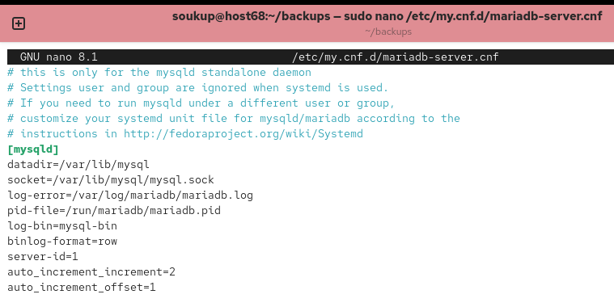
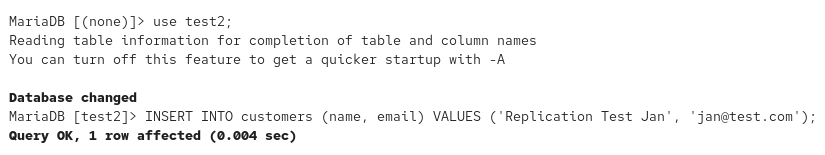
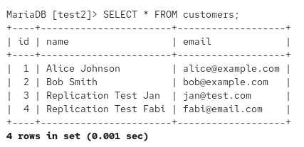

# DAT151: Assignment 8 Report

**Group:** 5

**Group Members:** Soukup Jan, Fabienne Feilke

**Date:** May 4, 2026

---

## Task 1: Backup

In this task you will set up a backup procedure for your MariaDB server. The backup should be
stored on a medium different from that of the disks storing the databases and indexes.
Important: Test your backup and recovery procedure first on databases with a little of data!
The backup should be done at regular intervals automatically e.g. as a cron job. The backup
procedure must also handle the binary logs. Binary logs must regularly be removed from disk or
the logs will fill the disk, but logs must not be deleted before they have been added to a backup.
Use the program mariadb-dump to make backups of the MariaDB databases . This program makes a
logical backup. It can dump all SQLs necessary to recreate tables and fill the tables with data.
The utility mariadb-dump can make a backup of all databases simultaneously, but this is usually not
a good solution. Recovery usually only involves a subset of databases and this is simpler if backup
of each database is made individually.
If relations exist between objects from different databases, all the involved databases must be
dumped simultaneously. We can remove this problem by restricting access from applications and
users to only one database.
The backup system should do the following:

- Backup each database individually.
- Backup the binary logs.
- Issue the necessary FLUSH and PURGE of the binary logs.
- Copy the backup to a disk on a different computer.

Backup should be done by a script at scheduled intervals using the cron system. Check the manual
pages for crontab.
When doing a backup, the databases and logs should be stored together. Tag the backups for easy
retrieval. A good idea is to put the databases and logs in a tar file and name the file with the date and
time of the backup. The file name can include a UNIX timestamp, but should also include the date
and time in a more human readable format.
You need to determine the active binary log. This can be achieved with the "--master-data=2"
option. The "--master-data" switch is best used together with the "--single-transaction" switch.
You should also issue a "FLUSH LOGS" command to start a new binary log somewhere in the
backup process.
What databases and tables should be included in the backup? The information_schema only
contains views and should be skipped. Skip also the database performance_schema. The database
mysql stores e.g. users and their grants. Your backup must include this information, but in a logical
form that can be used for a later restore. The switch --system of mariadb-dump can be used. This
switch let you dump different system tables as SQL that can be used to restore the data.
For all other databases, backup all database objects.
When doing backup of an individual database it might be useful to drop and recreate the database
before restoring data from the backup. The program mariadb-dump will only put a "CREATE
DATABASE" statement in the dump if used with options "--all-databases" or "--databases". When
backing up individual databases, either use "--databases" or let the backup script add to the top of
the dump:
CREATE DATABASE IF NOT EXISTS ...;
USE ...;

### Solution

We created example databases `test1` and `test2` with example tables and filled them with data.

```sql
CREATE DATABASE IF NOT EXISTS test1;
Query OK, 1 row affected (0.001 sec)

MariaDB [(none)]> USE test1;
Database changed
MariaDB [test1]> CREATE TABLE authors (
    ->     id INT PRIMARY KEY AUTO_INCREMENT,
    ->     name VARCHAR(100),
    ->     country VARCHAR(50)
    -> ) ENGINE=InnoDB;
Query OK, 0 rows affected (0.023 sec)

MariaDB [test1]> 
MariaDB [test1]> INSERT INTO authors (name, country) VALUES
    -> ('George Orwell', 'United Kingdom'),
    -> ('Haruki Murakami', 'Japan'),
    -> ('J.K. Rowling', 'United Kingdom');
Query OK, 3 rows affected (0.004 sec)
Records: 3  Duplicates: 0  Warnings: 0

MariaDB [test1]> 
MariaDB [test1]> CREATE TABLE books (
    ->     id INT PRIMARY KEY AUTO_INCREMENT,
    ->     title VARCHAR(200),
    ->     author_id INT,
    ->     published_year INT,
    ->     genre VARCHAR(50),
    ->     FOREIGN KEY (author_id) REFERENCES authors(id)
    -> ) ENGINE=InnoDB;
Query OK, 0 rows affected (0.018 sec)

MariaDB [test1]> 
MariaDB [test1]> INSERT INTO books (title, author_id, published_year, genre) VALUES
    -> ('1984', 1, 1949, 'Dystopian'),
    -> ('Norwegian Wood', 2, 1987, 'Romance'),
    -> ('Harry Potter and the Philosopher\'s Stone', 3, 1997, 'Fantasy');
Query OK, 3 rows affected (0.004 sec)
Records: 3  Duplicates: 0  Warnings: 0
```

```sql
CREATE DATABASE IF NOT EXISTS test2;
Query OK, 1 row affected (0.001 sec)

MariaDB [test1]> USE test2;
Database changed
MariaDB [test2]> CREATE TABLE customers (
    ->     id INT PRIMARY KEY AUTO_INCREMENT,
    ->     name VARCHAR(100),
    ->     email VARCHAR(100)
    -> ) ENGINE=InnoDB;
Query OK, 0 rows affected (0.016 sec)

MariaDB [test2]> 
MariaDB [test2]> INSERT INTO customers (name, email) VALUES
    -> ('Alice Johnson', 'alice@example.com'),
    -> ('Bob Smith', 'bob@example.com');
Query OK, 2 rows affected (0.002 sec)
Records: 2  Duplicates: 0  Warnings: 0

MariaDB [test2]> 
MariaDB [test2]> CREATE TABLE orders (
    ->     id INT PRIMARY KEY AUTO_INCREMENT,
    ->     customer_id INT,
    ->     product VARCHAR(100),
    ->     amount DECIMAL(10,2),
    ->     FOREIGN KEY (customer_id) REFERENCES customers(id)
    -> ) ENGINE=InnoDB;
Query OK, 0 rows affected (0.023 sec)

MariaDB [test2]> 
MariaDB [test2]> INSERT INTO orders (customer_id, product, amount) VALUES
    -> (1, 'Laptop', 1200.00),
    -> (1, 'Mouse', 25.50),
    -> (2, 'Keyboard', 45.99);
Query OK, 3 rows affected (0.005 sec)
Records: 3  Duplicates: 0  Warnings: 0
```


In our next step we had to enable binary logging.


Then we restarted the mariadb server. As we can see the binary logging is enabled now.


#### The Backup:

We use `mariadb-dump` with `--single-transaction` and `--master-data=2` to create a consistent, "point-in-time" snapshot of each database individually. It captures user permissions using the `--system` flag and forces a FLUSH LOGS to rotate the binary logs.

First we creating a **backup_user** and granting this user specific privileges like `SELECT` to read data, `RELOAD` and `SUPER` to manage binary logs, and `REPLICATION CLIENT` to identify the database's exact point-in-time position.

```sql
CREATE USER 'backup_user'@'localhost' IDENTIFIED BY 'backup_password';
Query OK, 0 rows affected (0.005 sec)

MariaDB [test1]> GRANT SELECT, RELOAD, PROCESS, LOCK TABLES, REPLICATION CLIENT, SUPER ON *.* TO 'backup_user'@'localhost';
Query OK, 0 rows affected (0.004 sec)

MariaDB [test1]> FLUSH PRIVILEGES;
Query OK, 0 rows affected (0.001 sec)
```


We set up crontab to run the Backup every day at 2am.


---

## Task 2: Recovery

You will need some data in the database system before you test your backup system. Create at least
two databases with tables.

- One database should store the tables of assignment 4, task 6.
- One database should store the tables of assignment 2, task 4.

Use the InnoDB engine for all tables to enforce referential integrity.
Perform the following steps on the databases:

1. Take backup of the databases. At this stage, table from lab4, task 6 that stores the
participants has 274 738 rows.
2. Insert 1000 new rows into the participant table. This table now has 275 738 rows.
3. Drop the table holding the participants. Due to foreign key constraints you must also delete
the coupling table connecting participants with events.
4. Create an empty table for participants using the original DDL.
5. Insert 100 rows into the table holding the participants. This table now has 100 rows.

Use the backups and the binary logs to restore the databases to current, but remove the effect of the
transaction that deleted the table with participants and the coupling table. I.e. restore the databases
as they would have been at current if you had not deleted and recreated tables at stage three and
four above.
Important: Always flush the binary log before loading data from backup!
The recovery must remove the effects of step three and four in the above list. The recovered table
with participants should have 275 738+1000+100 rows, or 275838 rows.

### Solution

We prepared and manipulated the ASSIGNMENT4 database according to the required sequence, then restored from backup and replayed binary logs while excluding the drop/recreate step.

#### a) Data manipulation sequence on ASSIGNMENT4

MariaDB output. We first checked if the count of participants is correct, then we added 1000 more, dropped `BOOKING` and `PARTICIPANT` tables. We then created the table `PARTICIPANT` again and added 100 new records into the table.

```sql
MariaDB [ASSIGNMENT4]> SELECT COUNT(*) FROM PARTICIPANT;
+----------+
| COUNT(*) |
+----------+
|   274738 |
+----------+

MariaDB [ASSIGNMENT4]> SET @max_id = (SELECT MAX(pId) FROM PARTICIPANT);
MariaDB [ASSIGNMENT4]> INSERT INTO PARTICIPANT (pId, sureName, givenNames)
	-> SELECT @max_id + seq, CONCAT('Smith_', seq), CONCAT('John_', seq)
	-> FROM seq_1_to_1000;
Query OK, 1000 rows affected

MariaDB [ASSIGNMENT4]> SELECT COUNT(*) FROM PARTICIPANT;
+----------+
| COUNT(*) |
+----------+
|   275738 |
+----------+

MariaDB [ASSIGNMENT4]> DROP TABLE BOOKING;
Query OK
MariaDB [ASSIGNMENT4]> DROP TABLE PARTICIPANT;
Query OK

MariaDB [ASSIGNMENT4]> CREATE TABLE PARTICIPANT (
	-> pId INT(10) UNSIGNED NOT NULL,
	-> sureName VARCHAR(50) NOT NULL,
	-> givenNames VARCHAR(50) NOT NULL,
	-> PRIMARY KEY (pId)
	-> ) ENGINE=InnoDB;
Query OK

MariaDB [ASSIGNMENT4]> INSERT INTO PARTICIPANT (pId, sureName, givenNames)
	-> SELECT seq, CONCAT('Doe_', seq), CONCAT('Jane_', seq)
	-> FROM seq_1_to_100;
Query OK, 100 rows affected

MariaDB [ASSIGNMENT4]> FLUSH LOGS;
Query OK
```

#### b) Binary log replay and issue

```bash
sudo mysqlbinlog --stop-position=24569 /var/lib/mysql/mysql-bin.000003 | sudo mysql
sudo mysqlbinlog --start-position=25211 /var/lib/mysql/mysql-bin.000003 | sudo mysql
...
ERROR 1105 (HY000) at line 32: Unknown error

sudo mysql -e "SELECT COUNT(*) FROM ASSIGNMENT4.PARTICIPANT;"
+----------+
| COUNT(*) |
+----------+
|   275738 |
+----------+
```

Why our restore failed for these commands:

- The failing replay corresponded to row-based replication events that tried to insert `ID`s that were already present in the restored base table.
- This is a primary key collision scenario, even though the output showed generic error 1105.
- As such we inserted the values manually and checked the result.
- As discussed during todays tutorial submission, the best way to go about this collision was to either use the already defined `auto-increment` to generate `ids` different to our last data, or to modify the mariadb `.bin` files - manually changing the collision `ids` to new ones and resolving the issue that way.

#### c) Final correction and required row count verification

```sql
USE ASSIGNMENT4;
SET @max_id = (SELECT MAX(pId) FROM PARTICIPANT);
INSERT INTO PARTICIPANT (pId, sureName, givenNames)
SELECT @max_id + seq, CONCAT('Doe_', seq), CONCAT('Jane_', seq)
FROM seq_1_to_100;
SELECT COUNT(*) AS Final_Row_Count FROM PARTICIPANT;

+-----------------+
| Final_Row_Count |
+-----------------+
|          275838 |
+-----------------+
```

---

## Task 3: Replication

### Requirement/Question (exact from PDF)

In this task you will set up database replication between a master and a slave. With replication, data
from the database master will be copied to the slave. If the master crashes, the replication slave will
have all the data and can replace the master.
The MariaDB manuals gives extensive documentation on installing and running a MariaDB master
with replicating slaves, see the chapter in MariaDB on Replication. You will use two computers
when solving this task.
The replication in MariaDB is asynchronous meaning that a transaction is committed when the
master successfully has committed the transaction. If the slave is not be working, or is slow, the
slave can lag the master by several transactions.
Replication can be handled also by the Distributed Replicated Block Device (DRDB) Linux kernel
module. DRBD can synchronously replicate storage, but we will not use DRDB in this assignment.
Set up a 2-way replication between two database servers, i.e. both servers should act as master and
slave for the other. If one of the servers fail, the other server should have all the data.
Check the synchronisation status in both ends. Make sure both servers report that the replication as
up and running.
Test the replication by manipulating data in the database you created in the first part of the
assignment. Check that the changes replicate to the other computer and make sure to test this in
both directions.

### Solution

We configured both MariaDB servers for binary logging and unique server IDs, created a replication user, and established two-way replication.

#### a) Server configuration

- We enabled binary logging.
- Used row-based binary format.
- Set unique server-id values on each host.
- Configured auto increment settings to avoid key collisions in dual-writer setup.




#### b) Replication user and master coordinates

MariaDB output:

```sql
CREATE USER 'replica_user'@'%' IDENTIFIED BY 'replica_password';
GRANT REPLICATION SLAVE ON *.* TO 'replica_user'@'%';
FLUSH PRIVILEGES;

FLUSH TABLES WITH READ LOCK;
SHOW MASTER STATUS;

+------------------+----------+--------------+------------------+
| File             | Position | Binlog_Do_DB | Binlog_Ignore_DB |
+------------------+----------+--------------+------------------+
| mysql-bin.000005 |      819 |              |                  |
+------------------+----------+--------------+------------------+

UNLOCK TABLES;
```


#### c) Configure slave side and verify sync state

MariaDB output:

```sql
CHANGE MASTER TO
  MASTER_HOST='10.0.0.67',
  MASTER_USER='replica_user',
  MASTER_PASSWORD='replica_password',
  MASTER_LOG_FILE='mysql-bin.000004',
  MASTER_LOG_POS=24525361;

START SLAVE;

SHOW SLAVE STATUS\G
*************************** 1. row ***************************
                Slave_IO_State: Waiting for master to send event
                   Master_Host: 10.0.0.67
                   Master_User: replica_user
                   Master_Port: 3306
                 Connect_Retry: 60
               Master_Log_File: mysql-bin.000004
           Read_Master_Log_Pos: 24525361
                Relay_Log_File: mariadb-relay-bin.000002
                 Relay_Log_Pos: 555
         Relay_Master_Log_File: mysql-bin.000004
              Slave_IO_Running: Yes
             Slave_SQL_Running: Yes
               Replicate_Do_DB: 
           Replicate_Ignore_DB: 
            Replicate_Do_Table: 
        Replicate_Ignore_Table: 
       Replicate_Wild_Do_Table: 
   Replicate_Wild_Ignore_Table: 
                    Last_Errno: 0
                    Last_Error: 
                  Skip_Counter: 0
           Exec_Master_Log_Pos: 24525361
               Relay_Log_Space: 866
               Until_Condition: None
                Until_Log_File: 
                 Until_Log_Pos: 0
            Master_SSL_Allowed: No
            Master_SSL_CA_File: 
            Master_SSL_CA_Path: 
               Master_SSL_Cert: 
             Master_SSL_Cipher: 
                Master_SSL_Key: 
         Seconds_Behind_Master: 0
 Master_SSL_Verify_Server_Cert: No
                 Last_IO_Errno: 0
                 Last_IO_Error: 
                Last_SQL_Errno: 0
                Last_SQL_Error: 
   Replicate_Ignore_Server_Ids: 
              Master_Server_Id: 2
                Master_SSL_Crl: 
            Master_SSL_Crlpath: 
                    Using_Gtid: No
                   Gtid_IO_Pos: 
       Replicate_Do_Domain_Ids: 
   Replicate_Ignore_Domain_Ids: 
                 Parallel_Mode: optimistic
                     SQL_Delay: 0
           SQL_Remaining_Delay: NULL
       Slave_SQL_Running_State: Slave has read all relay log; waiting for more updates
              Slave_DDL_Groups: 0
Slave_Non_Transactional_Groups: 0
    Slave_Transactional_Groups: 0
          Replicate_Rewrite_DB: 
1 row in set (0.000 sec)
```


#### d) Replication test by data manipulation

We inserted new rows in database test2 on one server and validated they appeared on the peer server.

MariaDB output from the insert side:

```sql
USE test2;
INSERT INTO customers (name, email)
VALUES ('Replication Test Jan', 'jan@test.com');
Query OK, 1 row affected
```



MariaDB output from validation side:


We then did the same on the peer server to validate the flow works both ways. Output from the server side:

```sql
USE test2;
SELECT * FROM customers;

| id | name                 | email            |
| 1  | Alice Johnson        | alice@example.com|
| 2  | Bob Smith            | bob@example.com  |
| 3  | Replication Test Jan | jan@test.com     |
| 4  | Replication Test Fabi| fabi@email.com   |
```

Output of peer server:


