# Task 1: Backup

First we have created more databases to have databases for the backup. We have created databases `test1` and `test2`. We also have already existing databases `privBase`, `czechia` from previous assignments that will participate in the backup.

```sql
use test2;
CREATE TABLE customers (
    id INT PRIMARY KEY AUTO_INCREMENT,
    name VARCHAR(100),
    email VARCHAR(100)
);

INSERT INTO customers (name, email) VALUES
('Alice Johnson', 'alice@example.com'),
('Bob Smith', 'bob@example.com');

CREATE TABLE orders (
    id INT PRIMARY KEY AUTO_INCREMENT,
    customer_id INT,
    product VARCHAR(100),
    amount DECIMAL(10,2),
    FOREIGN KEY (customer_id) REFERENCES customers(id)
);

INSERT INTO orders (customer_id, product, amount) VALUES
(1, 'Laptop', 1200.00),
(1, 'Mouse', 25.50),
(2, 'Keyboard', 45.99);

use test1;
CREATE TABLE authors (
    id INT PRIMARY KEY AUTO_INCREMENT,
    name VARCHAR(100),
    country VARCHAR(50)
);

INSERT INTO authors (name, country) VALUES
('George Orwell', 'United Kingdom'),
('Haruki Murakami', 'Japan'),
('J.K. Rowling', 'United Kingdom');

CREATE TABLE books (
    id INT PRIMARY KEY AUTO_INCREMENT,
    title VARCHAR(200),
    author_id INT,
    published_year INT,
    genre VARCHAR(50),
    FOREIGN KEY (author_id) REFERENCES authors(id)
);

INSERT INTO books (title, author_id, published_year, genre) VALUES
('1984', 1, 1949, 'Dystopian'),
('Norwegian Wood', 2, 1987, 'Romance'),
('Harry Potter and the Philosopher\'s Stone', 3, 1997, 'Fantasy');
```

We had to enable binary logging. To do so we created a new configuration file in `/etc/my.cnf.d/` with the following content:

```bash
[mysqld]
log-bin=mysql-bin
binlog-format=row
server-id=1
```

Then we restarted the mariadb server. As we can see the binary logging is enabled now.

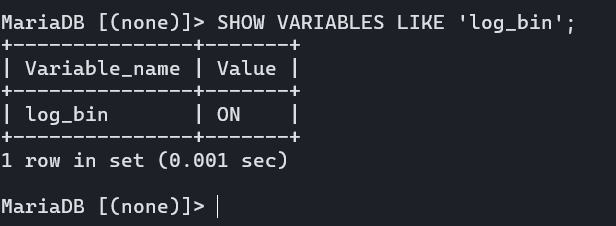

We have created backup script

```bash
#!/bin/bash

# === CONFIGURATION ===
MYSQL_USER="jkousalik"
MYSQL_PASSWORD="123456"
BACKUP_DIR="/home/jkousalik/backup/mariadb"
TMP_DIR="$BACKUP_DIR/tmp"
ARCHIVE_DIR="$BACKUP_DIR/archives"
REMOTE_DIR="glazrtom@10.0.0.76:/home/glazrtom/backup/mariadb/"
REMOTE_DIR_PASSWORD="123456789"
DATE_TAG=$(date +"%Y-%m-%d_%H-%M-%S")
ARCHIVE_NAME="mariadb_backup_${DATE_TAG}.tar.gz"

# Ensure required directories exist
mkdir -p "$TMP_DIR" "$ARCHIVE_DIR"

# === AUTH ===
MYSQL="mysql -u $MYSQL_USER -p$MYSQL_PASSWORD"
MYSQLDUMP="mysqldump -u $MYSQL_USER -p$MYSQL_PASSWORD"

# === DETECT DATABASES ===
DBS=( $(
echo "SHOW DATABASES WHERE \`Database\` NOT IN('mysql', 'information_schema','performance_schema')" | $MYSQL --skip-column-names
))

echo "Backing up ${#DBS[@]} databases..."

# === BACKUP DATABASES ===
first=1
for DB in "${DBS[@]}"; do
  echo "* Dumping database: $DB"
  if [ "$first" -eq 1 ]; then
      $MYSQLDUMP --flush-logs --opt --single-transaction --master-data=2 --databases "$DB" > "$TMP_DIR/$DB.sql"
      FIRST_DB="$DB"
      first=0
  else
      $MYSQLDUMP --opt --single-transaction --master-data=2 --databases "$DB" > "$TMP_DIR/$DB.sql"
  fi
done

# === BACKUP SYSTEM USERS + STATS ===
echo "Dumping system users and stats"
$MYSQLDUMP --system=users > "$TMP_DIR/system_users.sql"
$MYSQLDUMP --system=stats > "$TMP_DIR/system_stats.sql"

# === DETERMINE BINLOG INFO ===
ACTIVE_BINLOG=$(grep -- '-- CHANGE MASTER TO MASTER_LOG_FILE=' "$TMP_DIR"/"$FIRST_DB".sql | \
  grep -o "'.\+'" | tr -d "'")

LOG_BIN_BASENAME=$($MYSQL --skip-column-names -e "SELECT @@log_bin_basename;")
BINLOG_DIR="${LOG_BIN_BASENAME%/*}"

echo "Active binlog at backup start: $ACTIVE_BINLOG"
echo "Binlog directory: $BINLOG_DIR"

# === COLLECT BINLOG FILES ===
echo "Collecting relevant binary logs"
BINLOGS_TO_BACKUP=()
FOUND_ACTIVE=false

while read -r LOG_PATH; do
  file_name=$(basename "$LOG_PATH")
  BINLOGS_TO_BACKUP+=("$file_name")

  # If this file is the currently active one, set a flag
  if [[ "$file_name" == "$ACTIVE_BINLOG" ]]; then
    FOUND_ACTIVE=true
  fi
done < "$BINLOG_DIR/mysql-bin.index"

if [[ "$FOUND_ACTIVE" = false ]]; then
  echo "ERROR: Could not find active binlog in index. Aborting."
  exit 1
fi

for FILE in "${BINLOGS_TO_BACKUP[@]}"; do
  echo "* Copying $FILE"
  cp "$BINLOG_DIR/$FILE" "$TMP_DIR/"
done

# === CREATE ARCHIVE ===
echo "Creating archive: $ARCHIVE_NAME"
echo "Archiving to: $ARCHIVE_DIR/$ARCHIVE_NAME"
tar -czf "$ARCHIVE_DIR/$ARCHIVE_NAME" -C "$TMP_DIR" .

# === COPY TO REMOTE LOCATION ===
echo "Copying archive to remote disk: $REMOTE_DIR"
sshpass -p "$REMOTE_DIR_PASSWORD" scp "$ARCHIVE_DIR/$ARCHIVE_NAME" "$REMOTE_DIR"

# === PURGE OLD BINLOGS ===
echo "Purging old binary logs up to $ACTIVE_BINLOG"
$MYSQL -e "PURGE BINARY LOGS TO '$ACTIVE_BINLOG';"

# === CLEANUP ===
rm -rf "$TMP_DIR"/*

echo "Backup completed successfully at $(date)"
```

Running the backup script manually

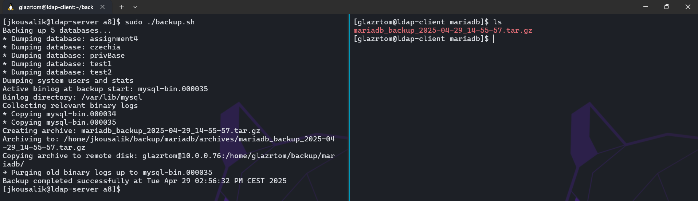

Setting up crontab to do the backup every hour (testing purposes, normally would be longer)

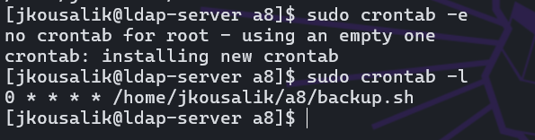

# Task 2: Recovery

- First we created the 3 required databases

```sql
CREATE DATABASE a8db1;

CREATE TABLE TaxClass (
    taxclass SMALLINT UNSIGNED NOT NULL AUTO_INCREMENT,
    description TEXT NOT NULL,
    PRIMARY KEY (taxclass)
);

CREATE TABLE Tollstation (
    tollstation SMALLINT UNSIGNED NOT NULL AUTO_INCREMENT,
    name VARCHAR(85) NOT NULL,
    PRIMARY KEY (tollstation)
);

CREATE TABLE Car (
    regno CHAR(7) NOT NULL,
    owner VARCHAR(85) NOT NULL,
    taxclass SMALLINT UNSIGNED NOT NULL,
    FOREIGN KEY (taxclass) REFERENCES TaxClass(taxclass),
    PRIMARY KEY(regno)
);

CREATE TABLE Fee (
    feenumber SMALLINT UNSIGNED NOT NULL AUTO_INCREMENT, -- A surrogate key
    taxclass SMALLINT UNSIGNED NOT NULL,
    type ENUM('regular','withsubscription'),
    costPerPassing DECIMAL(5,2),
    UNIQUE (taxclass,type), -- Candidate key
    PRIMARY KEY (feenumber),
    FOREIGN KEY (taxclass) REFERENCES TaxClass(taxclass)
);

CREATE TABLE Passing (
    timestamp DATETIME NOT NULL,
    regno CHAR(7) NOT NULL,
    tollstation SMALLINT UNSIGNED NOT NULL,
    PRIMARY KEY(timestamp,regno),
    FOREIGN KEY (tollstation) REFERENCES Tollstation (tollstation),
    FOREIGN KEY (regno) REFERENCES Car (regno)
);

CREATE TABLE Subscription (
    regno CHAR(7) NOT NULL,
    FOREIGN KEY (regno) REFERENCES Car(regno),
    PRIMARY KEY(regno)
);

CREATE TABLE TemporaryData (
    timestamp DATETIME,
    regno CHAR(7),
    tollstation_id SMALLINT UNSIGNED,
    tollstation_name VARCHAR(85),
    owner VARCHAR(85),
    taxclass_id SMALLINT UNSIGNED,
    taxclass_description TEXT,
    has_subscription ENUM('yes', 'no'),
    costPerPassing DECIMAL(5,2)
);

LOAD DATA LOCAL INFILE 'carpassingdb.txt'
INTO TABLE TemporaryData
CHARACTER SET utf8
FIELDS TERMINATED BY ';'
LINES TERMINATED BY '\n';

INSERT INTO TaxClass (taxclass, description)
SELECT DISTINCT taxclass_id, taxclass_description
FROM TemporaryData;

INSERT INTO Tollstation(tollstation, name)
SELECT DISTINCT tollstation_id, tollstation_name
FROM TemporaryData;

INSERT INTO Car(regno, owner, taxclass)
SELECT DISTINCT regno, owner, taxclass_id
FROM TemporaryData;

INSERT INTO Fee(taxclass, type, costPerPassing)
SELECT DISTINCT taxclass_id, CASE WHEN has_subscription = 'yes' THEN 'withsubscription' ELSE 'regular' END, costPerPassing
FROM TemporaryData;

INSERT INTO Subscription (regno)
SELECT DISTINCT regno
FROM TemporaryData
WHERE has_subscription = 'yes';

INSERT INTO Passing (timestamp, regno, tollstation)
SELECT timestamp, regno, tollstation_id
FROM TemporaryData;

DROP TABLE TemporaryData;

CREATE DATABASE a8db2;

CREATE TABLE Event (
    eventId INT PRIMARY KEY,
    eventTitle VARCHAR(255),
    eventDate DATETIME,
    totSpaces INT
);

CREATE TABLE Participant (
    pId INT PRIMARY KEY,
    sureName VARCHAR(100),
    givenNames VARCHAR(100)
);

CREATE TABLE Participation (
    eventId INT,
    pId INT,
    PRIMARY KEY (eventId, pId),
    FOREIGN KEY (eventId) REFERENCES Event(eventId) ON DELETE CASCADE,
    FOREIGN KEY (pId) REFERENCES Participant(pId) ON DELETE CASCADE
);

CREATE TABLE TempData (
    eventId INT,
    eventTitle VARCHAR(255),
    eventDate DATETIME,
    totSpaces INT,
    pId INT,
    sureName VARCHAR(100),
    givenNames VARCHAR(100),
    PRIMARY KEY (eventId, pId)
);

LOAD DATA LOCAL INFILE 'data.txt'
INTO TABLE TempData
CHARACTER SET utf8
FIELDS TERMINATED BY ';'
LINES TERMINATED BY '\n';

INSERT INTO Event (eventId, eventTitle, eventDate, totSpaces)
SELECT DISTINCT eventId, eventTitle, eventDate, totSpaces FROM TempData;

INSERT INTO Participant (pId, sureName, givenNames)
SELECT DISTINCT pId, sureName, givenNames FROM TempData;

INSERT INTO Participation (eventId, pId)
SELECT DISTINCT eventId, pId FROM TempData;

DROP TABLE TempData;

CREATE DATABASE a8db3;

CREATE TABLE FACULTY (
    fcode VARCHAR(10) PRIMARY KEY,
    fname VARCHAR(100) UNIQUE NOT NULL,
    phone_number VARCHAR(20) NOT NULL,
    address VARCHAR(255) NOT NULL
);

CREATE TABLE DEPARTMENT (
    dname VARCHAR(100) PRIMARY KEY,
    fcode VARCHAR(10) NOT NULL,
    FOREIGN KEY (fcode) REFERENCES FACULTY(fcode) ON DELETE CASCADE
);

CREATE TABLE COURSE (
    ccode VARCHAR(10) PRIMARY KEY,
    cname VARCHAR(100) NOT NULL,
    hours_per_week INT NOT NULL,
    dname VARCHAR(100) NOT NULL,
    FOREIGN KEY (dname) REFERENCES DEPARTMENT(dname) ON DELETE CASCADE
);

CREATE TABLE TEACHER (
    tnumber VARCHAR(20) PRIMARY KEY,
    tname VARCHAR(100) NOT NULL
);

CREATE TABLE COURSE_SCHEDULE (
    ccode VARCHAR(10) NOT NULL,
    cyear INT NOT NULL,
    tnumber VARCHAR(20) NOT NULL,
    PRIMARY KEY (ccode, cyear),
    FOREIGN KEY (ccode) REFERENCES COURSE(ccode) ON DELETE CASCADE,
    FOREIGN KEY (tnumber) REFERENCES TEACHER(tnumber) ON DELETE CASCADE
);

CREATE TABLE STUDENT (
    snumber VARCHAR(20) PRIMARY KEY,
    sname VARCHAR(100) NOT NULL,
    birth_number VARCHAR(12) UNIQUE NOT NULL,
    current_address VARCHAR(255) NOT NULL,
    telephone_number VARCHAR(20) NOT NULL,
    home_address VARCHAR(255) NOT NULL,
    birth_date DATE NOT NULL,
    sgender CHAR(1) NOT NULL,
    syear ENUM('1st', '2nd', '3rd') NOT NULL,
    fcode VARCHAR(10) NOT NULL,
    study_program ENUM('Computing', 'Chemistry', 'Teaching', 'Physics', 'Mathematics') NOT NULL,
    study_level ENUM('Bachelor', 'Master', 'PhD') NOT NULL,
    FOREIGN KEY (fcode) REFERENCES FACULTY(fcode) ON DELETE CASCADE
);

CREATE TABLE GRADE (
    snumber VARCHAR(20) NOT NULL,
    ccode VARCHAR(10) NOT NULL,
    cyear INT NOT NULL,
    grade CHAR(2) NOT NULL,
    PRIMARY KEY (snumber, ccode, cyear),
    FOREIGN KEY (snumber) REFERENCES STUDENT(snumber) ON DELETE CASCADE,
    FOREIGN KEY (ccode, cyear) REFERENCES COURSE_SCHEDULE(ccode, cyear) ON DELETE CASCADE
);
```

Perform the following steps on the databases:

1. **Take backup of the databases. At this stage, table Passing from lab 7 has 4 154 196 rows.**

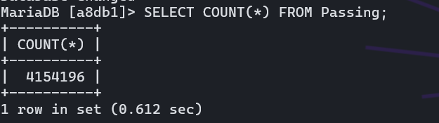

- We copied our script from the task 1 to take backup, but we’ve modified it to only to the backup on those 3 databases by coding the values inside the script `DBS=(a8db1 a8db2 a8db3)` and also prefixing the name of the backup by `MANUAL`

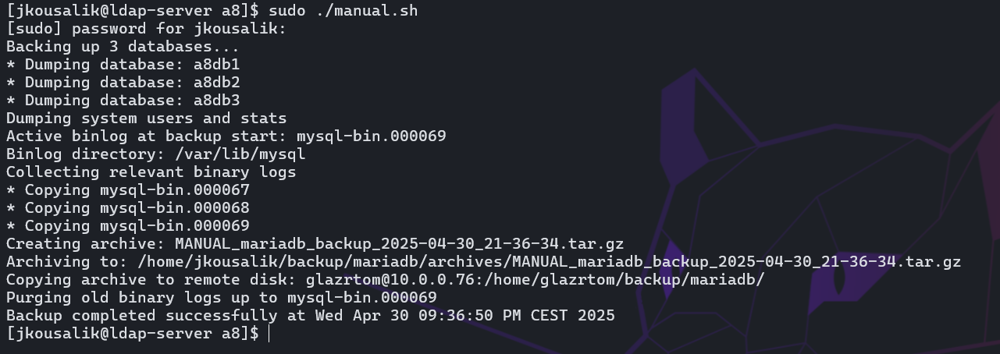

1. **Insert 1000 new rows into Passing. Table Passing now has 4 155 196 rows.**
    - SQL command we used for inserting 1000 rows:

```sql
INSERT INTO Passing (timestamp, regno, tollstation)
SELECT
  TIMESTAMP(DATE(NOW()) + INTERVAL FLOOR(RAND() * 45) DAY + INTERVAL FLOOR(RAND() * 86400) SECOND),
  c.regno,
  t.tollstation
FROM (
  SELECT regno FROM Car ORDER BY RAND() LIMIT 1000
) AS c
JOIN (
  SELECT tollstation FROM Tollstation ORDER BY RAND() LIMIT 1000
) AS t
ON TRUE
LIMIT 1000;
```

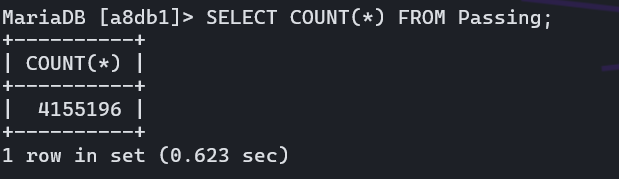

**3. Drop table Passing.**

`DROP TABLE Passing;`

1. **Create an empty table Passing using the original DDL.**

```sql
CREATE TABLE Passing (
    timestamp DATETIME NOT NULL,
    regno CHAR(7) NOT NULL,
    tollstation SMALLINT UNSIGNED NOT NULL,
    PRIMARY KEY(timestamp,regno),
    FOREIGN KEY (tollstation) REFERENCES Tollstation (tollstation),
    FOREIGN KEY (regno) REFERENCES Car (regno)
);
```

1. **Insert 100 rows into Passing. Table Passing now has 100 rows.**

```sql
INSERT INTO Passing (timestamp, regno, tollstation)
SELECT
  TIMESTAMP(DATE(NOW()) + INTERVAL FLOOR(RAND() * 45) DAY + INTERVAL FLOOR(RAND() * 86400) SECOND),
  c.regno,
  t.tollstation
FROM (
  SELECT regno FROM Car ORDER BY RAND() LIMIT 100
) AS c
JOIN (
  SELECT tollstation FROM Tollstation ORDER BY RAND() LIMIT 100
) AS t
ON TRUE
LIMIT 100;
```

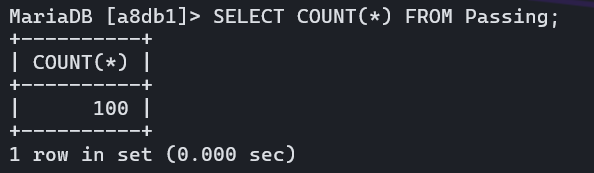

- Now we proceeded to the recovery. We flushed the current binary log file using the `FLUSH LOGS` command and then We extracted the manual backup and created and restored the database using command `mysql -u jkousalik -p < a8db1.sql` and found the log that was used before the recovery

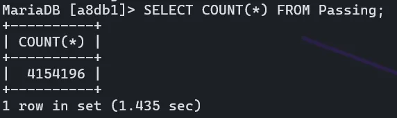

As we can see, the DB contains the original number of rows. 

Using command `mysqlbinlog` we can view the binary log and find timestamp until when we want to recover.

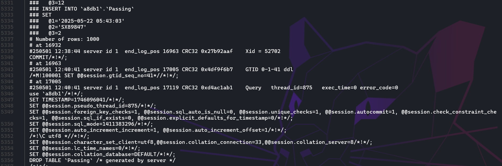

We found that we want to recover the binary log up to `16963` before the drop table.

Now we can restore the data using this command:

`sudo mysqlbinlog --stop-position=16963 /var/lib/mysql/mysql-bin.000087 | sudo mysql`

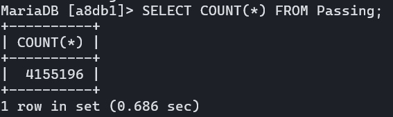

And now again using `mysqlbinlog` we want to find the insert of the 100 rows and recover that.

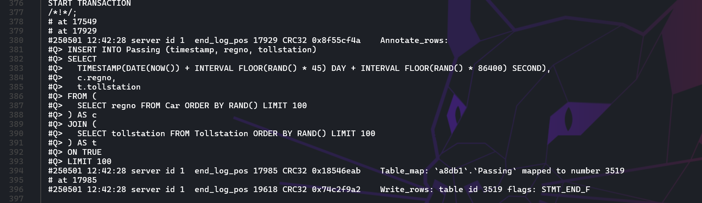

The starting position we want is `17507` and end position `19649`.

Using command 

`sudo mysqlbinlog --start-position=17507 --stop-position=19649 /var/lib/mysql/mysql-bin.000087 | sudo mysql`

We recover the 100 rows we inserted. After that we can see we have the final number of rows we should have.

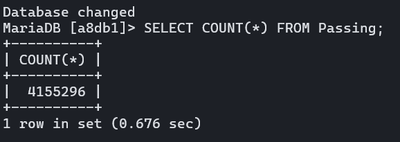

# Task 3: Replication

First we need to change configuration of the databases. We need to set

- server id that will be unique among those two databases
- auto increment configuration that ensures that concurrent inserting will not result in collision - one database will insert rows with odd numbers and one with even numbers. That way if data is inserted into both databases, the id will not collide with the other database
- bind address that allows listening to network communication outside of localhost

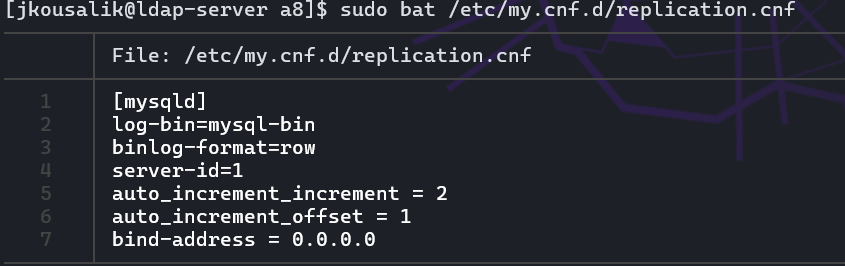

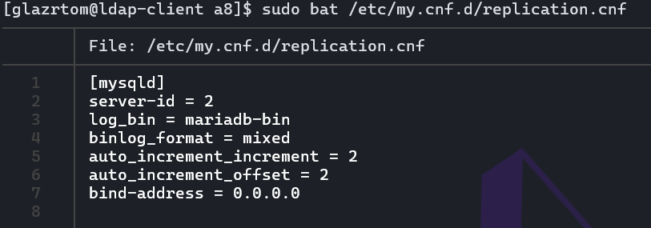

We need to create special users that will be used for the replication. We have created this user on both databases.

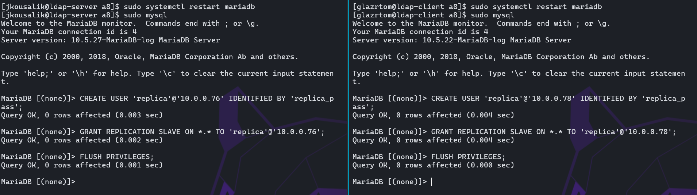

We flushed all tables with read lock on the master. We also dropped all databases on the seconds computer to have clean database.

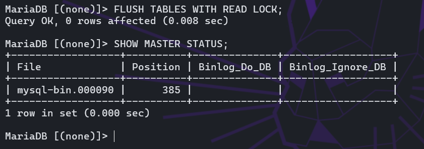

We have done backup/dump of all databases on the first computer. Then we copied the file to the second computer and uploaded the dump to the databases. Now we have same data on both databases.

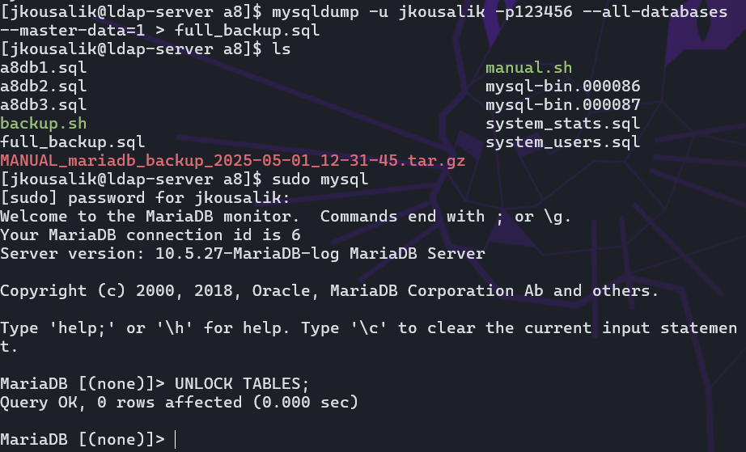

Now the databases are ready to enable the replication. To do this we run this command on the second computer (.76)

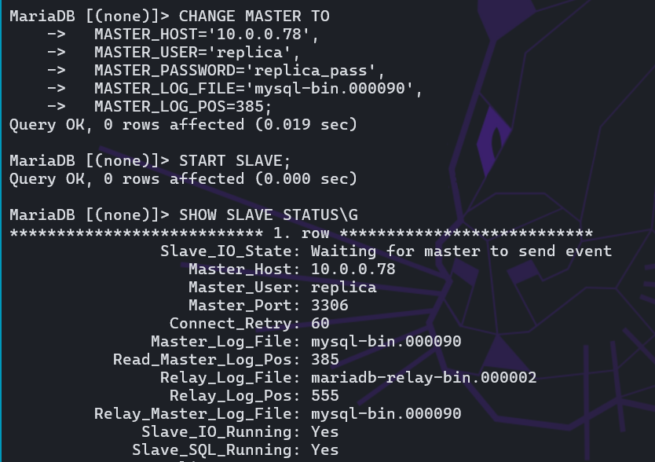

And on the first computer (.78)

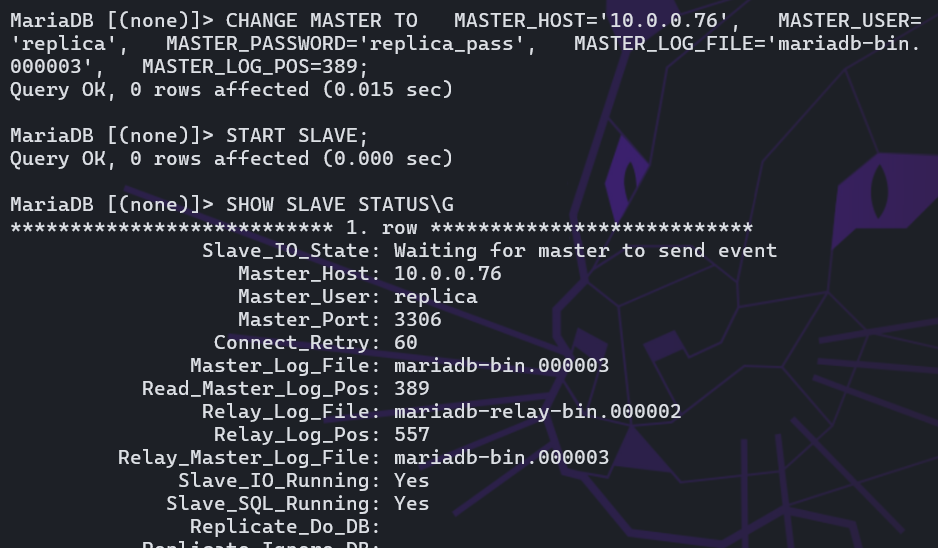

Now we had the setup done, we can test the replication. We inserted row id 4 on the first computer (.78) and inserted row id 5 on the second computer (.76).

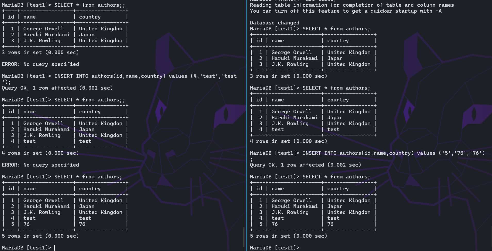

We can see that both rows are on both databases, so the replication is working correctly.